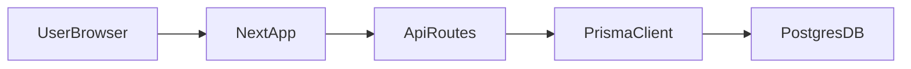

## RevME Forecaster Cup – Architecture

This document gives a high-level technical overview of the RevME Forecaster Cup platform so that future engineers and operators can understand, run, and extend the system.

It is complementary to:
- `README.md` – setup and developer commands
- `docs/PRD_RevME_Forecaster_Cup.md` – product requirements and UX/feature detail
- `docs/AWS_MIGRATION.md` – infrastructure and deployment guidance

---

## System Overview

- **Frontend**: Next.js App Router, React, TypeScript, Tailwind CSS + shadcn/ui.
- **Backend**: Next.js API routes under `src/app/api/**` (serverless-style handlers).
- **Database**: PostgreSQL accessed via Prisma (`prisma/schema.prisma`).
- **Auth**: Custom session system using a `Session` table and an HTTP-only cookie (`revme_session`).
- **Roles**: `STUDENT`, `SUPERVISOR`, `SUB_ADMIN`, `ADMIN` with additional fine-grained permissions.
- **Core domain**: Seasons, rounds, markets, teams, submissions, actuals, scoring runs, warnings, notifications, tickets, audit logs.

A simplified data-flow is:

---

## Domain Model (Prisma Overview)

Source of truth: `prisma/schema.prisma`.

### Users & Permissions

- `User`
  - Identity: `id`, `email`, `passwordHash`, `firstName`, `lastName`.
  - Role: `role` (`Role` enum: `STUDENT`, `SUPERVISOR`, `SUB_ADMIN`, `ADMIN`).
  - Flags: `emailVerified`, `rulesAcknowledgedAt`, `hasFullAccess`.
  - Relations: university, supervised teams, approved teams, team memberships, submissions, notifications, scoring runs, join requests, tickets, canned responses, permissions, actuals they created/updated, rounds they locked/scored.
- `Session`
  - Columns: `userId`, `token`, `expiresAt`, `createdAt`.
  - Used for cookie-based sessions.
- `Permission` / `UserPermission`
  - Supports permission names like `scoring:run`, `users:manage`, etc.
  - `UserPermission` links a user to a permission with `grantedAt` metadata.

### Universities, Teams, Memberships

- `University`
  - Represents an institution; has many users and teams.
- `Team`
  - Belongs to a `University`, `Season`, and `supervisor` (`User`).
  - Has `TeamStatus` (draft, pending approval, approved, active, rejected, disqualified).
  - Tracks `displayId`, approval timestamps, rejection/disqualification reason, warnings, score aggregates, prediction errors, support tickets.
- `TeamMember`
  - Join table between `User` and `Team`.
  - Flags: `isSubmitter` (who can submit forecasts for the team).
  - Uniqueness on `(userId, teamId)` to prevent duplicates.

### Seasons, Rounds, Markets

- `Season`
  - Status (`SeasonStatus`): `DRAFT`, `ACTIVE`, `PAUSED`, `COMPLETED`.
  - Registration flag, date range, and relations to teams, rounds, markets and scoring entities.
- `Round`
  - Per-season rounds with `number` (1–N), `opensAt`, `closesAt`, `isFinal`, `status` (`RoundStatus`).
  - Scoring/actuals governance:
    - `isLockedActuals`, `lockedAt`, `lockedById`.
    - `scoresStale`, `lastScoredAt`, `lastScoredById`.
    - `actualsVersion` used to track if scoring is up to date with actuals.
- `Market` / `SeasonMarket`
  - `Market`: a logical competition market (e.g., city/segment).
  - `SeasonMarket`: association for which markets are active in a season; `isActive` is used to enforce “exactly 3 markets” rules.

### Submissions & Actuals

- `Submission`
  - One per `(team, round)` pair (enforced by a unique index).
  - Contains `submittedById`, `submittedAt`, `locked` flag and `emailSentAt`.
  - Has many `SubmissionValue` rows.
- `SubmissionValue`
  - Per `(submission, market, metric, weekOffset)`.
  - `metric` is a `Metric` enum (`OCCUPANCY`, `ADR`).
  - Uniqueness on `(submissionId, marketId, metric, weekOffset)`.
- `Actual`
  - Actual values for `(season, round, market, metric, weekOffset)`, with `ActualSource` and `isVoided`.
  - Linked to the user who created/updated the value and a list of `ActualValueRevision` entries.
- `ActualValueRevision`
  - Append-only audit entries tracking who modified an `Actual` and how (`ActualRevisionAction`: `CREATE`, `EDIT`, `VOID`, `UNVOID`).

### Scoring & Analytics

- `PredictionError`
  - Stores per-team, per-round, per-market, per-metric, per-week prediction errors.
  - Fields:
    - `predictedValue`, `actualValue`, `absError`.
    - `apeError` (Average Percentage Error) which may be `null` when `actualValue = 0` and prediction is non-zero.
    - `scoringRunId` link for auditability.
- `ScoreAggregate`
  - Aggregated metrics per team/metric/scope:
    - `scopeType` (`ScopeType` enum: `SEASON`, `ROUND`, `MARKET_ROUND`).
    - Optional `roundId` / `marketId`.
    - `mape` (Mean Absolute Percentage Error) and `nErrors`.
  - Unique constraint on `(seasonId, teamId, metric, scopeType, roundId, marketId)`.
- `ScoringRun`
  - Audit log for each scoring execution:
    - `seasonId`, `scope` (`SEASON` or `ROUND`), optional `roundId`, `triggeredByAdminId`.
    - `status` (`ScoringRunStatus`: `RUNNING`, `SUCCESS`, `FAILED`), timestamps, counts.
    - `actualsVersionAtRun` and `summaryJson` to capture which rounds and versions were scored.

### Warnings, Notifications, Support & Governance

- `Warning`
  - Per team/round warning with `WarningType` (missed submission, late submission, admin warning).
- `Notification`
  - In-app notifications for events like leaderboard release.
- `SupportTicket` / `SupportTicketReply`
  - Ticketing between students, supervisors, and admins with categories, priorities, escalation metadata, feedback rating, and visibility controls.
- `CannedResponse`
  - Predefined response templates for support staff.
- `DemoRequest`, `MarketInfo`, `MarketResourceLink`, `MarketRoundUpdate`
  - Marketing/sales and educational content for the public site and admin growth tools.
- `AuditLog`
  - Generic audit trail of admin actions (user, action, entity type/id, before/after JSON, metadata).
- `EmailDispatch`
  - Tracks important outbound emails (type, recipient, round/team, timestamps).

---

## Request Flow & Authentication

### Session Model

Auth utilities live in `src/lib/auth.ts`.

- On successful login or registration:
  - `createSession(userId)`:
    - Generates a random token.
    - Creates a `Session` row with `userId`, `token`, `expiresAt`.
    - Sets an HTTP-only session cookie (`revme_session` locally, `__Secure-revme_session` in production) with:
      - `secure` in production.
      - `sameSite='lax'`.
      - Expiry synchronized with `expiresAt`.
- For every server-side request that needs a user:
  - `getSession()`:
    - Reads `revme_session` from cookies.
    - Looks up the `Session` by token.
    - If expired or missing, clears it and returns `null`.
    - Otherwise returns the associated `User` (including `university` relation).
- Logout:
  - `destroySession()` deletes all sessions for the cookie token and clears the cookie.

### Auth Guard Helpers

`src/lib/http.ts` (and matching server helpers) expose:

- `requireUser()` → returns `User` or throws `ApiError('UNAUTHORIZED')`.
- `requireAdmin(requiredPermission?)` → ensures user is admin/sub-admin with proper permissions.
- `requireUserOrResponse()` / `requireAdminOrResponse()` → convenience helpers that either return `{ user }` or an early `NextResponse`.

These functions are used inside API routes to centralize auth logic and error responses.

### Role & Permission Checks

`src/lib/permissions.ts`:

- `hasAdminAccess(user)`:
  - `true` if role is `ADMIN`, or `SUB_ADMIN` with `hasFullAccess`.
- `canPerformAdminAction(user, requiredPermission?)`:
  - `ADMIN` always allowed.
  - `SUB_ADMIN` allowed if:
    - `hasFullAccess`, or
    - they hold the requested `Permission` via `UserPermission`.

Client-side hooks like `usePermissions` are used to hide/disable admin UI if the user cannot perform certain actions.

---

## Frontend Structure

Main entry points live under `src/app` (Next.js App Router):

- `src/app/layout.tsx`
  - Root layout: global `<html>`, fonts, and `globals.css`.
- `src/app/page.tsx`
  - Public marketing site; renders `LandingPage` from `src/components/landing/sections.tsx`.

### Auth Routes (`src/app/(auth)` group)

- `login/page.tsx` – User login form; posts to `/api/auth/login`.
- `register/page.tsx` – Registration form; chooses `STUDENT` or `SUPERVISOR` role.
- `forgot-password/page.tsx`, `reset-password/page.tsx` – Password reset flows.

All auth pages are client components using `csrfFetch` for API calls and shared UI components.

### Dashboard Layout & Navigation

- `src/app/(dashboard)/layout.tsx`
  - Server component that:
    - Calls `getSession()`.
    - Redirects unauthenticated users to `/login`.
    - Enforces a “rules acknowledged” gate for students (redirects to `/rules` when needed).
    - Wraps content in a shared `Header` and `Sidebar`.
- `src/components/dashboard/header.tsx`
  - Shows logo, notification bell, user identity and role, and logout button.
- `src/components/dashboard/sidebar.tsx`
  - Role-based navigation:
    - Students: dashboard, join team, submit, scores, leaderboards, scoring verification, market info, rules/help, support, settings.
    - Supervisors: dashboard, join requests, support inbox, teams, reports, leaderboards, scoring verification, market info, settings.
    - Admin/Sub-admin: grouped nav (operate/people/compliance/growth/system: season, submissions, actuals, scoring, teams, users, audit logs, escalations, market info, demo requests, settings).

### Role-Specific Dashboards

- `src/app/(dashboard)/dashboard/page.tsx`
  - Server component that:
    - For admins/sub-admins: renders `AdminCommandCenter`.
    - For supervisors: shows supervisor dashboard (team counts, warnings, quick navigation).
    - For students: shows current season/round, countdown timer, team status, submissions, warnings, quick actions, team members, and recent activity.

### Key Feature Pages (Examples)

- `src/app/(dashboard)/submit/page.tsx`
  - Client-side submission form.
  - Loads current round, markets, and any existing submissions via feature APIs.
  - Enforces deadline countdown, lock reasons, progress tracking, and a review step before submission.
- `src/app/(dashboard)/scores/page.tsx`
  - Client-side score history and trends.
  - Loads user/team info, submission history, and scoring trends from APIs.
  - Displays summary cards, a line chart (via `ScoreTrendChart`), filters, and per-round detail tables.
- `src/app/(dashboard)/support/page.tsx`
  - Student support ticket center.
  - Shows supervisor info, existing tickets, and create/reply/feedback flows.
- `src/app/(dashboard)/supervisor/requests/page.tsx`
  - Supervisor join-request management (approve to existing team, create new team, reject).
- `src/app/(dashboard)/admin/users/page.tsx`
  - Admin user management (roles, reset links, force logout, delete).
- `src/app/(dashboard)/admin/teams/page.tsx`
  - Admin team management (stats, filters, disqualify/reinstate, details dialog).
- `src/app/(dashboard)/admin/scoring/page.tsx`
  - Scoring Control Center (round coverage, stale scores, run scoring, run warnings, scoring run history).

---

## Backend Structure

### API Routes

Location: `src/app/api/**`.

Broad groups:

- **Auth**
  - `/api/auth/login`, `/register`, `/logout`, `/forgot-password`, `/reset-password`, `/me`, `/permissions`.
- **Competition**
  - `/api/submissions/**` – submit forecasts, list history, current round status, CSV export.
  - `/api/scores/trends` – trend data for charts.
  - `/api/leaderboards` – leaderboard data.
  - `/api/market-info` – market information for participants.
- **Teams & Users**
  - `/api/teams/**` – team listing and creation (supervisor and admin paths).
  - `/api/join-requests` and `/api/supervisor/join-requests` – join request workflow.
  - `/api/users/me`, `/api/user/supervisor` – user profile and supervisor info.
- **Admin**
  - `/api/admin/season`, `/season/activate`, `/rounds/**` – season and round management.
  - `/api/admin/actuals/**` – actuals listing/upload, summary, and unvoiding.
  - `/api/admin/scoring/run`, `/api/admin/scoring/status` – scoring engine control.
  - `/api/admin/teams/**` – admin views and actions on teams (pending, disqualify, reinstate).
  - `/api/admin/users/**` – user management (role changes, reset, force logout, delete).
  - `/api/admin/audit-logs/**`, `/api/admin/command-center` – audit and command-center data.
  - `/api/admin/market-info/**` – market content, resource links, and round updates.
  - `/api/admin/demo-requests` – sales/demo management.
  - `/api/admin/warnings/run` – warnings generation job.
- **Support & Notifications**
  - `/api/support-tickets/**`, `/api/support-tickets/auto-escalate` – support flows.
  - `/api/notifications` – in-app notification listing.
- **Misc**
  - `/api/health` – health check endpoint.
  - `/api/request-demo` – public demo request capture.

### Shared Server Utilities

Key modules:

- `src/lib/db.ts`
  - Prisma client initialization and export.
- `src/lib/auth.ts`
  - Password hashing, password verification, session management, and simple role checks.
- `src/lib/http.ts`
  - `ApiError` class and helpers: `jsonOk`, `jsonError`, `parseJson`, `requireUser`, `requireAdmin`, `*OrResponse`.
- `src/lib/permissions.ts`
  - Permission and admin access helpers used by admin APIs and hooks.
- `src/lib/scoring.ts`
  - Scoring engine:
    - Creates a `ScoringRun` row.
    - Loads season, rounds, submissions, and actuals.
    - Computes per-value errors and upserts `PredictionError` rows.
    - Aggregates MAPE for season and rounds and upserts `ScoreAggregate` rows.
    - Marks rounds as locked and not stale when appropriate.
    - Handles success/failure, updates `ScoringRun`, returns a structured result.
- `src/lib/rate-limit.ts`
  - In-memory rate limiting helper (simple bucket by key).
- `src/lib/audit.ts`, `src/lib/logger.ts`, `src/lib/email.ts`, `src/lib/utils.ts`, `src/lib/client-logger.ts`, `src/lib/csrf.ts`
  - Audit logging, logging, email dispatch helpers, utilities, client-side logging, and CSRF helpers used across server and client code.

---

## Scoring Logic

The scoring implementation follows the competition rules defined in the PRD and `docs/PRD_RevME_Forecaster_Cup.md`.

> Staging validation source of truth: RevME ranks teams by Mean Absolute Percentage Error (MAPE). Lower is better.

### Per-Value Error

For each `SubmissionValue` and matching `Actual`:

- `absError = |predictedValue - actualValue|`.
- `apeError` (Absolute Percentage Error) is:
  - `0` when `actualValue == 0` and `predictedValue == 0`.
  - `null` (excluded) when `actualValue == 0` and `predictedValue != 0` (warns organizers).
  - `absError / actualValue` otherwise.

These values are stored in `PredictionError` along with `seasonId`, `teamId`, `roundId`, `marketId`, `metric`, `weekOffset`, and `scoringRunId`.

### Aggregates & Final Scores

`computeAggregates` in `src/lib/scoring.ts`:

- For each team:
  - For each metric (`OCCUPANCY`, `ADR`):
    - Filters all `PredictionError` rows for that team/metric with non-null `apeError`.
    - Computes `MAPE = average(apeError)`.
    - Upserts a `ScoreAggregate` row for:
      - Season-level scope (`ScopeType.SEASON`).
      - Round-level scope (`ScopeType.ROUND`) per round.
- Combined final score for the UI is:
  - `(Occupancy MAPE + ADR MAPE) / 2`, expressed as a percentage.

The **Scoring Control Center** UI (admin page) reports:
- Per-round actuals coverage and submission coverage.
- Whether scores are stale for any round (`scoresStale`).
- A table of recent scoring runs (status, scope, counts, version).

---

## Testing & Quality

- **Unit / integration tests** live under `src/test/**`:
  - RBAC, scoring behavior, warnings, round gating, HTTP utilities, and other critical logic.
- **Verification commands** (from `README.md`):
  - `npm run lint` – ESLint.
  - `npm run typecheck` – TypeScript.
  - `npm test` – Vitest.
  - `npm run build` – Next.js production build.

Before deploying or making large changes, run all of the above.

---

## Environments & Configuration

See `README.md` and `docs/AWS_MIGRATION.md` for details.

### Environment Files

- `.env.local` – local development.
- `.env.test` – test environment.
- `.env.docker` – Docker-based local stack.
- Production/staging environments should use managed secret stores (e.g., AWS Secrets Manager or SSM Parameter Store) instead of `.env` files.

### Key Environment Variables

- `DATABASE_URL` – PostgreSQL connection string (local or RDS).
- `NEXT_PUBLIC_APP_URL` – base URL used by the frontend.
- `SMTP_*` – optional email provider configuration for welcome and notification emails.

### Deployment Notes

- Use a managed Postgres instance (e.g., AWS RDS).
- Run Prisma migrations as part of deployment:
  - `npx prisma migrate deploy`.
- Then build and start the app:
  - `npm run build`
  - `npm run start`

For a detailed AWS path (Vercel + RDS, ECS Fargate, or Elastic Beanstalk), see `docs/AWS_MIGRATION.md`.
